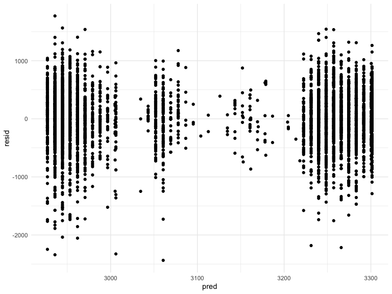
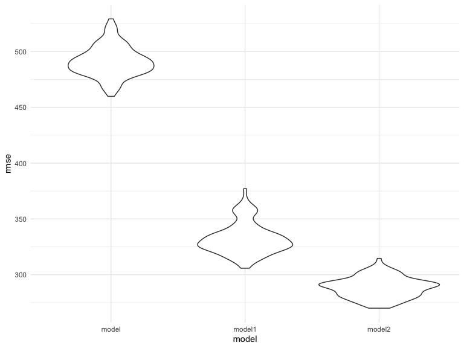
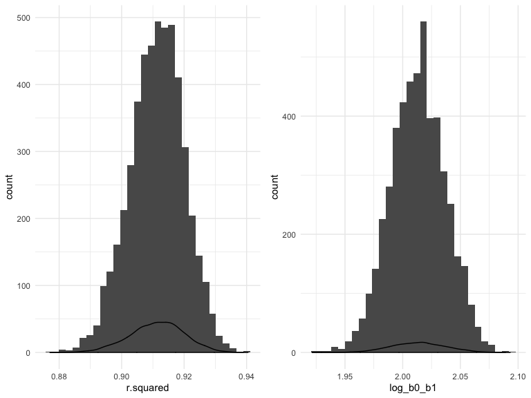

Homework\_6
================
Arielle
11/20/2019

### Problem 1

First read the data into R using the read csv code. Cleaned and renamed the data and changes the variables that needed to be changed.

``` r
birthweight = read_csv("data/birthweight.csv")
```

    ## Parsed with column specification:
    ## cols(
    ##   .default = col_double()
    ## )

    ## See spec(...) for full column specifications.

``` r
df_birthweight = 
birthweight %>% 
  janitor::clean_names() %>% 
  mutate( 
    babysex = factor(babysex,  levels= c("1", "2"),
                               labels = c("Male", "Female")),
    frace = factor(frace, levels = c("1", "2", "3","4","8","9"),
                          labels = c("White", "Black", "Asian","Puerto Rican","Other", "Unknown")),
    malform = factor(malform, levels = c("0", "1"),
                              labels = c("absent", "present")),
    mrace = factor(mrace, levels = c("1", "2", "3","4","8","9"),
                          labels = c("White", "Black", "Asian","Puerto Rican","Other", "Unknown")))

skimr::skim(df_birthweight)
```

    ## Skim summary statistics
    ##  n obs: 4342 
    ##  n variables: 20 
    ## 
    ## ── Variable type:factor ────────────────────────────────────────────────────
    ##  variable missing complete    n n_unique
    ##   babysex       0     4342 4342        2
    ##     frace       0     4342 4342        5
    ##   malform       0     4342 4342        2
    ##     mrace       0     4342 4342        4
    ##                               top_counts ordered
    ##              Mal: 2230, Fem: 2112, NA: 0   FALSE
    ##  Whi: 2123, Bla: 1911, Pue: 248, Asi: 46   FALSE
    ##                abs: 4327, pre: 15, NA: 0   FALSE
    ##  Whi: 2147, Bla: 1909, Pue: 243, Asi: 43   FALSE
    ## 
    ## ── Variable type:numeric ───────────────────────────────────────────────────
    ##  variable missing complete    n      mean     sd     p0     p25     p50
    ##     bhead       0     4342 4342   33.65     1.62  21      33      34   
    ##   blength       0     4342 4342   49.75     2.72  20      48      50   
    ##       bwt       0     4342 4342 3114.4    512.15 595    2807    3132.5 
    ##     delwt       0     4342 4342  145.57    22.21  86     131     143   
    ##   fincome       0     4342 4342   44.11    25.98   0      25      35   
    ##   gaweeks       0     4342 4342   39.43     3.15  17.7    38.3    39.9 
    ##  menarche       0     4342 4342   12.51     1.48   0      12      12   
    ##   mheight       0     4342 4342   63.49     2.66  48      62      63   
    ##    momage       0     4342 4342   20.3      3.88  12      18      20   
    ##    parity       0     4342 4342    0.0023   0.1    0       0       0   
    ##   pnumlbw       0     4342 4342    0        0      0       0       0   
    ##   pnumsga       0     4342 4342    0        0      0       0       0   
    ##     ppbmi       0     4342 4342   21.57     3.18  13.07   19.53   21.03
    ##      ppwt       0     4342 4342  123.49    20.16  70     110     120   
    ##    smoken       0     4342 4342    4.15     7.41   0       0       0   
    ##    wtgain       0     4342 4342   22.08    10.94 -46      15      22   
    ##      p75   p100     hist
    ##    35      41   ▁▁▁▁▅▇▁▁
    ##    51      63   ▁▁▁▁▁▇▁▁
    ##  3459    4791   ▁▁▁▃▇▇▂▁
    ##   157     334   ▁▇▅▁▁▁▁▁
    ##    65      96   ▁▂▇▂▂▂▁▃
    ##    41.1    51.3 ▁▁▁▁▃▇▁▁
    ##    13      19   ▁▁▁▁▂▇▁▁
    ##    65      77   ▁▁▁▅▇▂▁▁
    ##    22      44   ▂▇▅▂▁▁▁▁
    ##     0       6   ▇▁▁▁▁▁▁▁
    ##     0       0   ▁▁▁▇▁▁▁▁
    ##     0       0   ▁▁▁▇▁▁▁▁
    ##    22.91   46.1 ▁▇▅▁▁▁▁▁
    ##   134     287   ▁▇▆▁▁▁▁▁
    ##     5      60   ▇▁▁▁▁▁▁▁
    ##    28      89   ▁▁▁▇▇▁▁▁

Created a model that included family income as well as father's race and see if there was realtionship with baby birthweight.

``` r
model = lm(bwt ~ fincome + frace, data = df_birthweight) 
model %>% 
  broom::tidy() %>% 
  select(term, estimate, p.value) %>% 
  knitr::kable(digits = 3)
```

| term              |  estimate|  p.value|
|:------------------|---------:|--------:|
| (Intercept)       |  3218.116|    0.000|
| fincome           |     0.867|    0.005|
| fraceBlack        |  -295.326|    0.000|
| fraceAsian        |   -96.492|    0.186|
| fracePuerto Rican |  -187.877|    0.000|
| fraceOther        |   -69.607|    0.596|

``` r
modelr::add_residuals(df_birthweight, model) %>% 
modelr::add_predictions(model) %>% 
ggplot(aes(x = pred, y = resid)) +geom_point()
```



The next thing I did was run the two comparison models that were given in the homework.

``` r
model1 = lm(bwt ~ blength + gaweeks, data = df_birthweight)

model1 %>% 
  broom::tidy() %>% 
  select(term, estimate, p.value) %>% 
  knitr::kable(digits = 3)
```

| term        |   estimate|  p.value|
|:------------|----------:|--------:|
| (Intercept) |  -4347.667|        0|
| blength     |    128.556|        0|
| gaweeks     |     27.047|        0|

``` r
model2 = lm(bwt ~ bhead + blength + babysex + bhead*blength + bhead*babysex + blength*babysex + bhead*blength*babysex, data = df_birthweight)

model2 %>% 
  broom::tidy() %>% 
  select(term, estimate, p.value) %>% 
  knitr::kable(digits = 3)
```

| term                        |   estimate|  p.value|
|:----------------------------|----------:|--------:|
| (Intercept)                 |  -7176.817|    0.000|
| bhead                       |    181.796|    0.000|
| blength                     |    102.127|    0.000|
| babysexFemale               |   6374.868|    0.000|
| bhead:blength               |     -0.554|    0.478|
| bhead:babysexFemale         |   -198.393|    0.000|
| blength:babysexFemale       |   -123.773|    0.000|
| bhead:blength:babysexFemale |      3.878|    0.000|

Below is the code for the cross- validation step to look at the three models together.

``` r
cv_df =
  crossv_mc(df_birthweight, 100) %>% 
  mutate(
    train = map(train, as_tibble),
    test = map(test, as_tibble))
```

``` r
cv_df = 
  cv_df %>% 
  mutate(model  = map(train, ~lm(bwt ~ fincome + frace, data = .x)),
         model1     = map(train, ~lm(bwt ~ blength + gaweeks, data = .x)),
         model2  = map(train, ~lm(bwt ~ bhead + blength + babysex + bhead*blength + bhead*babysex + blength*babysex + bhead*blength*babysex, data = as_tibble(.x)))) %>% 
  mutate(rmse_model = map2_dbl(model, test, ~rmse(model = .x, data = .y)),
         rmse_model1    = map2_dbl(model1, test, ~rmse(model = .x, data = .y)),
         rmse_model2 = map2_dbl(model2, test, ~rmse(model = .x, data = .y)))
```

``` r
cv_df %>% 
  select(starts_with("rmse")) %>% 
pivot_longer(
    everything(),
    names_to = "model", 
    values_to = "rmse",
    names_prefix = "rmse_") %>% 
  mutate(model = fct_inorder(model)) %>% 
  ggplot(aes(x = model, y = rmse)) + geom_violin()
```



The model2 is the best model to use out of theses three models.

### Problem 2

``` r
weather_df = 
  rnoaa::meteo_pull_monitors(
    c("USW00094728"),
    var = c("PRCP", "TMIN", "TMAX"), 
    date_min = "2017-01-01",
    date_max = "2017-12-31") %>%
  mutate(
    name = recode(id, USW00094728 = "CentralPark_NY"),
    tmin = tmin / 10,
    tmax = tmax / 10) %>%
  select(name, id, everything())
```

    ## Registered S3 method overwritten by 'crul':
    ##   method                 from
    ##   as.character.form_file httr

    ## Registered S3 method overwritten by 'hoardr':
    ##   method           from
    ##   print.cache_info httr

    ## file path:          /Users/ariellecoq/Library/Caches/rnoaa/ghcnd/USW00094728.dly

    ## file last updated:  2019-09-26 10:25:30

    ## file min/max dates: 1869-01-01 / 2019-09-30

Entered in the dataset for problem two from the course website. Below Is the code that worked with the bootstrapping. Bootstrapped a total of 5000, and set up the data in order to find the disrtibutions.

``` r
boots_df = weather_df %>% 
  modelr::bootstrap(n = 5000) %>% 
  mutate(
    models = map(strap, ~ lm(tmax ~ tmin, data = .x)),
    results = map(models, broom::tidy),
    glance = map(models, broom::glance)) %>% 
  select(results, glance, .id) %>% 
  unnest(results) %>% 
  pivot_wider( 
    names_from = term,
    values_from = c(estimate, std.error, glance),
    id_cols = .id) %>%
  janitor::clean_names() %>%
  unnest(c(glance_intercept), .names_repair = "universal") %>% 
  mutate(
    log_b0_b1 = log(estimate_intercept * estimate_tmin)
  ) 
```

Next ran a ggplot to see the distributions of the r-squared as well as the log bo\_b1, To ssee if they were normal distributed or not.

``` r
plot1 = boots_df %>% 
  ggplot(aes(x = r.squared)) + 
  geom_histogram() + 
  geom_density() +
  theme_minimal() 

plot2 = boots_df %>% 
  ggplot(aes(x = log_b0_b1)) + 
  geom_histogram() + 
  geom_density() +
  theme_minimal() 

plot1 + plot2
```

    ## `stat_bin()` using `bins = 30`. Pick better value with `binwidth`.
    ## `stat_bin()` using `bins = 30`. Pick better value with `binwidth`.



Both the r-squared as well as the log\_bo\_b1 plot seem to be normally distributed.

Used the boot strap 5000, to produced the quantiles for both the r-squared and the log\_bo\_b1 to get the 95% confidence interval for both.

``` r
boots_df %>% 
  pull(r.squared) %>% 
  quantile(c(0.025, 0.975)) %>% 
  knitr::kable(col.names = "R-Squared")
```

|       |  R-Squared|
|-------|----------:|
| 2.5%  |  0.8936977|
| 97.5% |  0.9274807|

``` r
boots_df %>% 
  pull(log_b0_b1) %>% 
  quantile(c(0.025, 0.975)) %>% 
  knitr::kable(col.names = "Log(B0*B1)")
```

|       |  Log(B0\*B1)|
|-------|------------:|
| 2.5%  |     1.966942|
| 97.5% |     2.058528|

The 95% confidence interavl for the r-squared is 0.894 - 0.927 and the 95% confidence interavl for the log\_b0\_b1 is 1.966 - 2.058.
